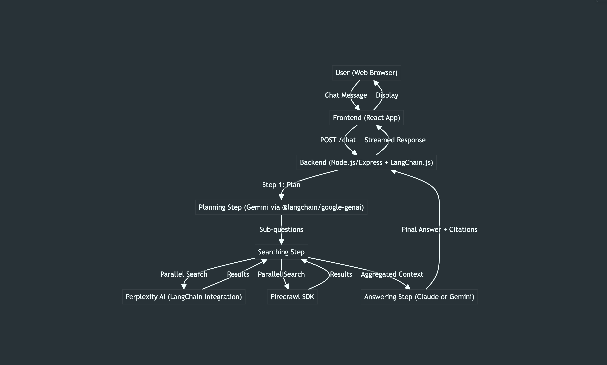

# Financial Agent Demo

> **100% Vibe Coding with Claude Task Master** 🚀  
> *From idea to implementation - entirely AI-driven development*

A sophisticated financial question-answering system built through pure AI-driven development in only 2 hours. This project demonstrates the power of **"vibe coding"** - where you provide just the idea, and AI handles everything from PRD creation to task management to implementation.

## 🤖 The "Vibe Coding" Approach

This entire project was built using the **Claude Task Master** workflow:

1. **💡 Human Input**: "I want a financial agent that can answer questions with citations"
2. **📋 AI Creates PRD**: Claude generates a comprehensive Product Requirements Document
3. **📝 AI Breaks Down Tasks**: Task Master parses the PRD and creates structured development tasks
4. **⚡ AI Implements**: Claude executes each task, writes code, handles dependencies
5. **🔄 AI Adapts**: Real-time updates to future tasks based on implementation discoveries

**No traditional project planning. No manual task tracking. Just pure AI-driven development.**

## 🏗️ Architecture

The system implements a sophisticated 3-step agentic architecture for reliable financial information:



### Multi-Step Process:
1. **🎯 Planning Step**: Gemini AI breaks down user questions into targeted research sub-questions
2. **🔍 Searching Step**: Parallel search using Perplexity AI and Firecrawl for comprehensive data gathering
3. **💬 Answering Step**: Claude/Gemini synthesizes research into well-cited, comprehensive answers

## ✨ Features

- **🎨 Clean Chat Interface**: Modern React-based UI with real-time streaming responses
- **🧠 Multi-Model AI**: Leverages Google Gemini, Perplexity AI, and Claude for different specialized tasks
- **📚 Comprehensive Research**: Combines AI-powered search with targeted web scraping
- **🔗 Source Citations**: Every answer includes proper citations and source links
- **⚡ Real-time Streaming**: Live response streaming for better user experience
- **🏃‍♂️ Parallel Processing**: Simultaneous search across multiple data sources

## 🛠️ Tech Stack

### Frontend
- **React 18** with modern hooks
- **Vite** for fast development and building
- **Custom CSS** for clean, responsive design
- **Streaming API integration** for real-time responses

### Backend
- **Node.js + Express** server
- **LangChain.js v0.3** for AI orchestration
- **Google Gemini** via `@langchain/google-genai` for planning
- **Perplexity AI** integration for broad search capabilities
- **Firecrawl SDK** for targeted web data extraction
- **Claude/Anthropic SDK** for final answer synthesis

### AI Services
- **Google Gemini**: Question analysis and research planning
- **Perplexity AI**: Broad AI-powered search with LangChain integration
- **Firecrawl**: Targeted web scraping and data extraction
- **Claude**: Advanced reasoning and answer synthesis with citations

## 🚀 Quick Start

### Prerequisites
```bash
# Required API keys in .env
ANTHROPIC_API_KEY=your_anthropic_key
GOOGLE_API_KEY=your_gemini_key
PERPLEXITY_API_KEY=your_perplexity_key
FIRECRAWL_API_KEY=your_firecrawl_key
```

### Installation
```bash
# Install dependencies
npm install

# Start development servers
npm run dev
```

This starts both frontend (React) and backend (Express) servers concurrently.

### Usage
1. Open your browser to `http://localhost:5173`
2. Ask any financial question: *"What's the current P/E ratio of Apple?"*
3. Watch the AI agent plan, research, and deliver a comprehensive answer with citations

## 📋 The AI-Driven Development Process

This project showcases the **Claude Task Master** methodology:

### 1. PRD Generation
```bash
# AI creates comprehensive PRD from simple idea
task-master parse-prd scripts/PRD.txt
```

### 2. Task Breakdown
```bash
# AI analyzes complexity and creates implementation tasks
task-master analyze-complexity --research
task-master expand --all --research
```

### 3. Development Workflow
```bash
# AI determines next task based on dependencies
task-master next

# AI tracks progress and updates future tasks
task-master set-status --id=1 --status=done
task-master update --from=5 --prompt="Implementation changes discovered"
```

### 4. Continuous Adaptation
- **Real-time task updates** as implementation evolves
- **Dependency management** ensures proper build order
- **Context preservation** across development sessions

## 🎯 Key Endpoints

- `POST /chat` - Main chat endpoint that handles the 3-step agentic process
- `GET /health` - Health check endpoint
- Response streaming via Server-Sent Events (SSE)

## 📊 Project Structure

```
financial-agent-demo/
├── frontend/          # React application
│   ├── src/
│   │   ├── components/    # Chat UI components
│   │   ├── hooks/         # Custom React hooks
│   │   ├── services/      # API service layer
│   │   └── styles/        # Component styling
├── backend/           # Express server
│   ├── routes/            # API routes
│   ├── services/          # AI service integrations
│   │   ├── gemini/        # Google Gemini integration
│   │   └── search/        # Perplexity & Firecrawl
├── scripts/           # Task Master configuration
│   ├── PRD.txt           # AI-generated requirements
│   └── architect-diagram.png
└── tasks/             # AI-generated development tasks
    ├── tasks.json        # Structured task definitions
    └── task_*.txt        # Individual task files
```

## 🔧 Development Features

### AI-Powered Task Management
- **Complexity analysis** for optimal task breakdown
- **Dependency tracking** with visual indicators
- **Research-backed subtask generation** using Perplexity AI
- **Real-time progress tracking** and status updates

### Error Handling & Resilience
- **Graceful API failures** with fallback strategies
- **Comprehensive logging** for debugging
- **Connection status monitoring** in the UI
- **Retry mechanisms** for external service calls

## 🎨 Design Philosophy

This project demonstrates:
- **AI-First Development**: Let AI handle the heavy lifting
- **Agentic Architecture**: Multi-step reasoning for better outputs
- **Modern UX**: Clean, responsive, and intuitive interface
- **Scalable Structure**: Well-organized code for future enhancements

## 🚦 Current Status

✅ **Completed Features**:
- Full 3-step agentic pipeline
- React frontend with streaming responses
- Multi-model AI integrations
- Comprehensive error handling
- Real-time chat interface

🔄 **Future Enhancements**:
- User authentication and chat history
- Additional financial data sources
- Model selection interface
- Enhanced citation formatting
- Performance optimizations

## 🤝 Contributing

This project serves as a demonstration of AI-driven development. The entire codebase was generated and managed through Claude Task Master, showcasing what's possible when AI handles the development process.

## 📄 License

MIT License - Feel free to explore and adapt this AI-driven development approach for your own projects.

---

**Built with 🤖 Claude Task Master** - *Where ideas become reality through AI-driven development*
